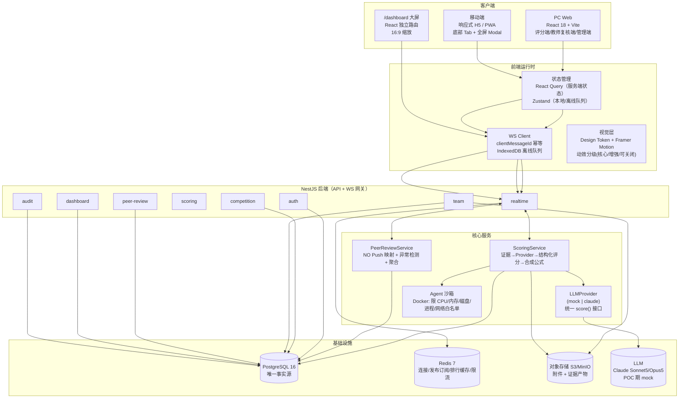

# M1 架构总览与决策记录

版本：V1.0（M1 设计基线）
日期：2026-08-26
依据：[PRD-TASK项目考核打分系统.md](../PRD-TASK项目考核打分系统.md)、[开发流程与实施计划.md](../开发流程与实施计划.md)

> 本阶段定位：**架构与交互设计**。只产出设计基线（架构、ER、契约、Design Token、流程、算法、组件样例、可运行设计系统原型），**不落地可运行后端/数据库**——那是 M2（工程基础设施）与 M3（核心评分闭环）的职责。

---

## 1. 本阶段决策记录（ADR）

| # | 决策点 | 结论 | 理由 |
|---|---|---|---|
| D1 | 前端框架 | **React 18 + Vite + TypeScript** | Framer Motion 对赛博故障/霓虹动效生态最成熟；与 code(1).md 技术栈一致 |
| D2 | 后端框架 | **NestJS**（模块化 + 依赖注入 + 内建 WebSocket 网关） | 开发流程已锁定，模块边界清晰可映射 |
| D3 | 数据库 | **PostgreSQL 16**（唯一事实源） | 支持 JSONB、事务、不可变版本表 |
| D4 | 缓存/实时 | **Redis 7**：连接状态、发布订阅、排行榜短缓存、限流 | 缓存不是事实源，宕机不影响评分写入 |
| D5 | 对象存储 | **S3 兼容（MinIO local / S3 prod）**，附件与证据产物不入库 | PRD「不将大文件直接放入数据库」 |
| D6 | 实时协议 | **WebSocket**（Socket.io 或原生 ws 二选一，M2 定），幂等 + 离线队列 | PRD 7 |
| D7 | 评分编排 | 单一 `ScoringService`，Agent 走同一 `LLMProvider` 接口（mock/claude 可替换） | M0.5 冻结的接口约定 |
| D8 | 互评口径 | **以 PRD 冻结版为准**：随机一对一映射 + 队长单次评分 | 见 §2 冲突口径 |
| D9 | 评分 Rubric | **数据驱动、不硬编码**：维度/权重/子项/阈值存 `rubrics` 表（版本化），评分时注入 Agent | 后续可改，评分交 Agent |

---

## 2. 规则冲突口径（重要）

`code (1).md` 与 PRD 冻结版在互评算法上冲突，**以 PRD 冻结版为准**：

| 项 | code (1).md 旧口径 | PRD 冻结版（采用） |
|---|---|---|
| 互评单位 | 成员级积分池分配 | **团队级**，不评价成员 |
| 评分方式 | 固定积分池 + 极差≥阈值校验 | **队长单次 0–100 整数分** |
| 映射 | 未定义 | **随机一对一映射**（不自评/不重复/全覆盖） |
| 得分计算 | 匿名聚合 | **有效分 = 收到评分 / 100 × 5**（0–5，1 位小数） |

> 「NO Push」在本系统即 **随机一对一映射 + 双盲 + 异常检测**，不是积分池/强制分布。详细见 [M1-05](./M1-05-NO-Push互评算法.md)。

---

## 3. 系统架构图



---

## 4. 后端模块划分（NestJS）

| 模块 | 职责 | 对应 PRD |
|---|---|---|
| `auth` | 登录/刷新/`/me`、JWT 鉴权、角色 guard | §2 |
| `competition` | 比赛 CRUD、规则配置、截止时间、分配教师、锁定/发布 | §3 |
| `team` | 团队/成员/资料/附件/版本快照/提交/截止锁定 | §3、§4 |
| `scoring` | 触发 Agent 评分、评分版本、教师复核、合成公式、批准发布 | §5 |
| `peer-review` | NO Push 映射、双盲访问、队长单次评分、异常检测、聚合 | §6 |
| `dashboard` | 只读 published 数据的聚合查询（排名/雷达/词云/Sankey/跑马灯） | §8 |
| `audit` | 操作日志、评分版本审计、互评映射审计 | §5.3、§6.2 |
| `realtime` | WebSocket 网关、幂等、离线队列回放、订阅过滤 | §7 |

**跨模块约定**：业务规则（权重、范围校验、合成公式、NO Push 映射校验）全部在服务端模块内执行，前端仅交互与展示。

---

## 5. 前端工程结构（M2 落地时）

```
apps/web/
├── src/
│   ├── app/                 # 路由（react-router）
│   │   ├── auth/            # 登录
│   │   ├── team/            # 团队提交
│   │   ├── scoring/         # Agent 评分 + 教师复核
│   │   ├── peer-review/     # 队长互评
│   │   ├── results/         # 结果查看
│   │   └── dashboard/       # /dashboard 大屏
│   ├── components/          # 赛博组件（NeonSlider/GlitchButton/…）
│   ├── theme/               # Design Token（tokens.css + tailwind 映射）
│   ├── lib/
│   │   ├── ws/              # WS client + 幂等 + 离线队列(IndexedDB)
│   │   ├── api/             # REST client（axios/fetch）
│   │   └── motion/          # 动效分级开关
│   └── store/               # Zustand（本地/离线状态）
├── packages/contracts/      # 前后端共享 TS 类型（API/WS payload）—— M2 建立
└── packages/ui/             # 共享组件（如需要）
```

---

## 6. 对象存储与附件方案

- **附件**（报告/原型/视频/图片）上传后写入对象存储，数据库只存 `objectKey` + 元数据 + `版本号` + `访问状态`。
- **证据产物**（截图、OCR、ASR 转录、Lighthouse 报告、控制台日志）由 Agent 管线写入对象存储，`evidence.locator` 只存定位信息，不存大对象。
- **大屏不暴露原始附件地址**：附件访问走带时效签名的后端代理，观众/大屏不可拿原始 URL。
- 附件入库前校验链（PRD §5.3）：`MIME/扩展名白名单 → 病毒扫描(ClamAV) → 大小限制(单文件 200MB)`。

---

## 7. 非功能基线（M1 设计需满足）

| 项 | 目标 |
|---|---|
| 性能 | 评分页首屏 ≤3s(4G)；大屏 60FPS、低端自动关 3D/粒子 |
| 可靠性 | 评分提交事务写入；消息可重试不重复计分；关键操作可审计 |
| 安全 | 附件白名单+扫描；日志不落完整隐私；SSRF 防护（URL 访问控制） |
| 可用性 | 核心评分 API 月度 99.5% |
| 扩展 | 横向扩展无状态 API；Redis 承载连接与发布订阅 |

---

## 8. 后续文档索引

| 文档 | 内容 |
|---|---|
| [M1-01 数据库 Schema 与 ER 图](./M1-01-数据库Schema与ER图.md) | 表结构 + DDL + ER 图 |
| [M1-02 API 与 WebSocket 契约](./M1-02-API与WebSocket契约.md) | REST/WS/错误码/幂等/权限矩阵 |
| [M1-03 Design Token 与组件规范](./M1-03-Design-Token与组件规范.md) | 视觉 token/组件清单/动效分级 |
| [M1-04 页面流程图](./M1-04-页面流程图.md) | 7 条核心流程 + 三档响应式 |
| [M1-05 NO Push 互评算法](./M1-05-NO-Push互评算法.md) | 伪代码 + 异常检测 + 聚合 |
| [M1-06 大屏聚合与脱敏](./M1-06-大屏聚合与脱敏.md) | 大屏组件拆分 + 聚合口径 + 脱敏 |
| [M1-07 关键组件代码](./M1-07-关键组件代码.md) | React+TS+Tailwind 组件样例 |
| [design-system.html](./design-system.html) | 可运行设计系统原型 |
