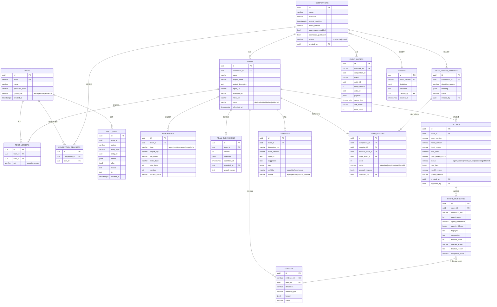

# M1-01 数据库 Schema 与 ER 图

版本：V1.0（M1 设计基线）
数据库：PostgreSQL 16（唯一事实源）

> 设计原则：① 评分/评语/互评/附件全部**不可变版本**（append-only，新版本=新行，不 UPDATE 覆盖）；② 关键业务规则约束下沉到 DB（唯一约束、CHECK、外键）；③ 大字段/附件走对象存储，库内只存元数据与定位。

---

## 1. ER 图（Mermaid）



---

## 2. 关键表 DDL（节选）

### 2.1 用户与角色

```sql
CREATE TABLE users (
  id            uuid PRIMARY KEY DEFAULT gen_random_uuid(),
  email         varchar(320) NOT NULL UNIQUE,
  name          varchar(50)  NOT NULL,
  password_hash text         NOT NULL,
  global_role   varchar(20)  NOT NULL CHECK (global_role IN ('admin','teacher','audience')),
  created_at    timestamptz  NOT NULL DEFAULT now()
);

-- 教师与比赛的分配关系（管理员操作）
CREATE TABLE competition_teachers (
  id             uuid PRIMARY KEY DEFAULT gen_random_uuid(),
  competition_id uuid NOT NULL REFERENCES competitions(id) ON DELETE CASCADE,
  user_id        uuid NOT NULL REFERENCES users(id) ON DELETE CASCADE,
  UNIQUE (competition_id, user_id)
);
```

### 2.2 比赛与团队

```sql
CREATE TABLE competitions (
  id                  uuid PRIMARY KEY DEFAULT gen_random_uuid(),
  name                varchar(100) NOT NULL,
  timezone            varchar(64)  NOT NULL DEFAULT 'Asia/Shanghai',
  submit_deadline     timestamptz  NOT NULL,
  rubric_version      varchar(50)  NOT NULL,
  peer_review_enabled boolean      NOT NULL DEFAULT true,
  dashboard_published boolean      NOT NULL DEFAULT false,
  status              varchar(20)  NOT NULL DEFAULT 'draft'
                      CHECK (status IN ('draft','active','closed')),
  created_by          uuid REFERENCES users(id),
  created_at          timestamptz NOT NULL DEFAULT now()
);

CREATE TABLE teams (
  id                  uuid PRIMARY KEY DEFAULT gen_random_uuid(),
  competition_id      uuid NOT NULL REFERENCES competitions(id) ON DELETE CASCADE,
  name                varchar(50) NOT NULL,
  project_name        varchar(100) NOT NULL,
  project_description text,
  report_url          text,
  prototype_url       text,
  video_url           text,
  status              varchar(20) NOT NULL DEFAULT 'draft'
                      CHECK (status IN ('draft','submitted','locked','published')),
  submitted_at        timestamptz,
  created_at          timestamptz NOT NULL DEFAULT now(),
  -- 团队名在同一比赛内唯一（PRD §4）
  UNIQUE (competition_id, name)
);

CREATE TABLE team_members (
  id      uuid PRIMARY KEY DEFAULT gen_random_uuid(),
  team_id uuid NOT NULL REFERENCES teams(id) ON DELETE CASCADE,
  user_id uuid NOT NULL REFERENCES users(id) ON DELETE CASCADE,
  role    varchar(20) NOT NULL CHECK (role IN ('captain','member')),
  -- 一个成员在同一比赛内只能属于一个团队（PRD §4）→ 用部分唯一索引由应用层配合校验，
  -- 此处至少保证 (team_id, user_id) 唯一
  UNIQUE (team_id, user_id)
);
```

> 说明：`team_members` 的「同比赛内成员唯一」需要跨表唯一性，PostgreSQL 无法用单一约束表达，可在应用层事务内校验（同一 `competition_id` 下查重）或在 `teams` 上冗余 `competition_id` 配合触发器。M1 记为**服务端事务校验项**，M3 实现。

### 2.3 附件与提交版本

```sql
CREATE TABLE attachments (
  id            uuid PRIMARY KEY DEFAULT gen_random_uuid(),
  team_id       uuid NOT NULL REFERENCES teams(id) ON DELETE CASCADE,
  type          varchar(20) NOT NULL CHECK (type IN ('report','prototype','video','image','other')),
  object_key    text NOT NULL,          -- 对象存储 key，不落库大文件
  file_name     varchar(255) NOT NULL,
  mime_type     varchar(100) NOT NULL,
  size_bytes    bigint NOT NULL CHECK (size_bytes <= 209715200),  -- 200MB
  version       int NOT NULL DEFAULT 1,
  access_status varchar(20) NOT NULL DEFAULT 'available',
  uploaded_at   timestamptz NOT NULL DEFAULT now(),
  created_by    uuid REFERENCES users(id)
);

-- 提交即生成不可变版本快照（PRD §4）
CREATE TABLE team_submissions (
  id            uuid PRIMARY KEY DEFAULT gen_random_uuid(),
  team_id       uuid NOT NULL REFERENCES teams(id) ON DELETE CASCADE,
  version       int NOT NULL,
  snapshot      jsonb NOT NULL,   -- 提交时刻的团队+成员+附件清单
  submitted_at  timestamptz NOT NULL DEFAULT now(),
  unlocked_by   uuid REFERENCES users(id),
  unlock_reason text,
  UNIQUE (team_id, version)
);
```

### 2.4 证据（PRD §5.4 定位规范）

```sql
CREATE TABLE evidence (
  id            uuid PRIMARY KEY DEFAULT gen_random_uuid(),
  evidence_id   varchar(50) NOT NULL UNIQUE,   -- 如 DOC-REPORT-001
  competition_id uuid NOT NULL REFERENCES competitions(id) ON DELETE CASCADE,
  team_id       uuid NOT NULL REFERENCES teams(id) ON DELETE CASCADE,
  dimension     varchar(40) NOT NULL,
  material_type varchar(30) NOT NULL
                CHECK (material_type IN ('pdf','docx','markdown','image','online_prototype','local_web','video','perf')),
  locator       jsonb NOT NULL,   -- 结构随 material_type 变（file/page/section/url/steps/截图/时间戳…）
  extracted_at  timestamptz NOT NULL DEFAULT now(),
  status        varchar(20) NOT NULL DEFAULT 'available'
);
```

### 2.5 评分（不可变版本 + 合成公式）

```sql
CREATE TABLE scores (
  id               uuid PRIMARY KEY DEFAULT gen_random_uuid(),
  team_id          uuid NOT NULL REFERENCES teams(id) ON DELETE CASCADE,
  score_version    varchar(20) NOT NULL,        -- v1/v2/…（重评生成新行）
  rubric_version   varchar(50) NOT NULL,
  input_version    varchar(80) NOT NULL,        -- 输入资料版本，如 proj-01@ts
  final_score      numeric(5,1),                -- 合成后 1 位小数
  peer_review_score numeric(3,1),               -- NO Push 0–5
  status           varchar(20) NOT NULL DEFAULT 'agent_scored'
                   CHECK (status IN ('not_started','processing','agent_scored','needs_review','approved','published')),
  risk_flags       jsonb NOT NULL DEFAULT '[]',
  model_version    varchar(50),
  prompt_version   varchar(20),
  generated_at     timestamptz NOT NULL DEFAULT now(),
  created_by       uuid REFERENCES users(id),
  approved_by      uuid REFERENCES users(id),
  approved_at      timestamptz,
  UNIQUE (team_id, score_version)
);

CREATE TABLE score_dimensions (
  id              uuid PRIMARY KEY DEFAULT gen_random_uuid(),
  score_id        uuid NOT NULL REFERENCES scores(id) ON DELETE CASCADE,
  dimension_key   varchar(40) NOT NULL,   -- report_quality / interaction_visual / …
  agent_score     int CHECK (agent_score BETWEEN 0 AND 100),
  agent_confidence numeric(3,2) CHECK (agent_confidence BETWEEN 0 AND 1),
  agent_evidence  jsonb NOT NULL DEFAULT '[]',  -- evidence_id 数组（引用校验命中 evidence 表）
  highlight       text,                  -- ≥10 字，服务端校验
  suggestion      text,                  -- ≥10 字
  teacher_score   int CHECK (teacher_score BETWEEN 0 AND 100),
  teacher_action  varchar(20) CHECK (teacher_action IN ('approve','suggest_modify','insufficient')),
  teacher_reason  text,                  -- 修改原因 ≥10 字
  composite_score numeric(5,2),          -- agent×0.7 + teacher×0.3
  UNIQUE (score_id, dimension_key)
);
```

> 合成公式（PRD §5.1）：`composite_score = agent_score*0.7 + teacher_score*0.3`；`final_score = Σ(composite_score × weight) + peer_review_score`。权重/子项/阈值**数据驱动**，读 `rubrics` 表（见 §2.9），评分时随 `rubric_version` 注入 Agent 提示词，**不在代码中硬编码**；提交速度由系统注入，`agent_score/teacher_score` 均为系统值，教师不可改。

### 2.6 评语（可见性 + 版本）

```sql
CREATE TABLE comments (
  id             uuid PRIMARY KEY DEFAULT gen_random_uuid(),
  team_id        uuid NOT NULL REFERENCES teams(id) ON DELETE CASCADE,
  dimension_key  varchar(40) NOT NULL,
  score_version  varchar(20) NOT NULL,
  highlight      text NOT NULL,
  suggestion     text NOT NULL,
  tags           jsonb NOT NULL DEFAULT '[]',   -- #架构优雅 等预置标签
  visibility     varchar(20) NOT NULL DEFAULT 'captain'
                 CHECK (visibility IN ('captain','all','dashboard')),
  source         varchar(20) NOT NULL DEFAULT 'agent'
                 CHECK (source IN ('agent','teacher','manual_fallback')),
  created_by     uuid REFERENCES users(id),
  created_at     timestamptz NOT NULL DEFAULT now()
);
```

### 2.7 互评映射与评分（NO Push，PRD §6）

```sql
CREATE TABLE peer_review_mappings (
  id                uuid PRIMARY KEY DEFAULT gen_random_uuid(),
  competition_id    uuid NOT NULL REFERENCES competitions(id) ON DELETE CASCADE,
  algorithm_version varchar(20) NOT NULL,       -- 映射算法版本
  mapping           jsonb NOT NULL,             -- [{reviewer_team, target_team}, …]
  status            varchar(20) NOT NULL DEFAULT 'active',
  created_by        uuid REFERENCES users(id),
  created_at        timestamptz NOT NULL DEFAULT now()
);

CREATE TABLE peer_reviews (
  id               uuid PRIMARY KEY DEFAULT gen_random_uuid(),
  competition_id   uuid NOT NULL REFERENCES competitions(id) ON DELETE CASCADE,
  mapping_id       uuid NOT NULL REFERENCES peer_review_mappings(id),
  reviewer_team_id uuid NOT NULL REFERENCES teams(id),
  target_team_id   uuid NOT NULL REFERENCES teams(id),
  score            int CHECK (score BETWEEN 0 AND 100),
  status           varchar(20) NOT NULL DEFAULT 'submitted'
                   CHECK (status IN ('submitted','suspicious','valid','invalid')),
  anomaly_reasons  jsonb NOT NULL DEFAULT '[]',
  submitted_by     uuid REFERENCES users(id),   -- 队长 user_id（UI 层脱敏，不暴露身份）
  submitted_at     timestamptz NOT NULL DEFAULT now(),
  UNIQUE (mapping_id, reviewer_team_id)         -- 队长单次评分
);
```

### 2.8 审计与消息队列（PRD §7）

```sql
CREATE TABLE audit_logs (
  id          uuid PRIMARY KEY DEFAULT gen_random_uuid(),
  actor_id    uuid,
  action      varchar(80) NOT NULL,       -- e.g. score.review / team.unlock / mapping.generate
  entity_type varchar(40) NOT NULL,
  entity_id   uuid,
  before      jsonb,
  after       jsonb,
  reason      text,
  ip          inet,
  created_at  timestamptz NOT NULL DEFAULT now()
);
CREATE INDEX idx_audit_entity ON audit_logs(entity_type, entity_id);

-- 服务端事件出箱：支撑 WS 幂等 + 离线增量回放
CREATE TABLE event_outbox (
  id             uuid PRIMARY KEY DEFAULT gen_random_uuid(),
  message_id     varchar(64) NOT NULL UNIQUE,
  competition_id uuid NOT NULL,
  event          varchar(80) NOT NULL,
  entity_id      uuid,
  entity_version int,
  actor_id       uuid,
  payload        jsonb NOT NULL DEFAULT '{}',
  server_time    timestamptz NOT NULL DEFAULT now(),
  ack_status     varchar(20) NOT NULL DEFAULT 'pending',  -- pending/acked/failed
  retry_count    int NOT NULL DEFAULT 0
);
CREATE INDEX idx_outbox_time ON event_outbox(server_time);
```

### 2.9 评分标准（rubrics，数据驱动、不硬编码）

> 用户要求：判分标准可后续更改。维度/权重/子项/阈值全部存表，评分时按 `rubric_version` 注入 Agent；调整标准 = 新增一条版本记录，不改代码、不迁移。当前阶段评分口径不重要，统一交由 Agent 出分。

```sql
CREATE TABLE rubrics (
  id             uuid PRIMARY KEY DEFAULT gen_random_uuid(),
  rubric_version varchar(50) NOT NULL UNIQUE,   -- e.g. poc-uncalibrated / v1 / v2
  definition     jsonb NOT NULL,                 -- { dimensions:[{key,weight,subs,source}], thresholds:{...}, submitSpeedRule:{...} }
  calibrated     boolean NOT NULL DEFAULT false, -- 阈值是否已标定（M0.5b 后置 true）
  created_by     uuid REFERENCES users(id),
  created_at     timestamptz NOT NULL DEFAULT now()
);
```

> `rubrics.definition` 即原 `config/rubric.json` 内容的数据库落点；`competitions.rubric_version` 与 `scores.rubric_version` 都指向它。默认种子数据见 M3 迁移脚本。

---

## 3. Redis 键规划（缓存/实时，非事实源）

| 键 | 类型 | 用途 | 过期 |
|---|---|---|---|
| `ws:conn:{userId}` | set | 用户在线连接 socketId 集合 | 连接断开即删 |
| `ws:sub:{competitionId}` | set | 比赛订阅关系 | — |
| `rank:{competitionId}` | zset | 排行榜短缓存（member=teamId, score=final_score） | 60s |
| `rate:{userId}:{action}` | counter | 限流计数（登录/提交/触发评分） | 窗口期 |
| `pubsub:{competitionId}:{event}` | channel | 发布订阅转发 | — |

> Redis 宕机时：停止实时广播但不影响 PostgreSQL 评分写入（PRD §12 应急策略）。

---

## 4. 一致性要点

1. **不可变版本**：`scores`、`comments`、`attachments`、`team_submissions` 均 append-only；重评/改分/解锁生成新 `version` 行，历史不覆盖。
2. **证据引用硬校验**：`score_dimensions.agent_evidence` 中的 `evidence_id` 必须在 `evidence` 表存在，否则 `risk_flags` 打 `unresolved_evidence` 并 `needs_review`（对应 M0.5 `cite.py`）。
3. **评分事务**：一次评分写入 = `scores` + `score_dimensions` 多行，同事务提交，避免半成品版本。
4. **互评聚合幂等**：`peer_reviews` 以 `(mapping_id, reviewer_team_id)` 唯一约束保证队长单次评分，重复提交不重复计分。
5. **大屏只读 published**：`dashboard` 模块查询统一加 `WHERE s.status='published'` 且附件不返回 `object_key`。
