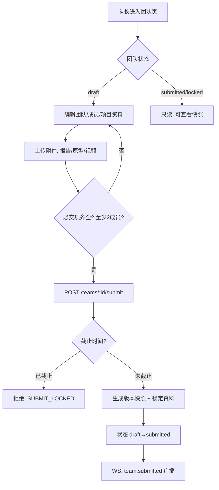
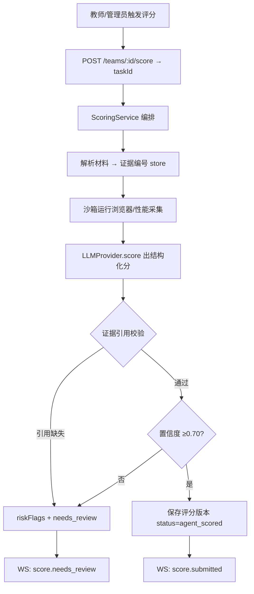
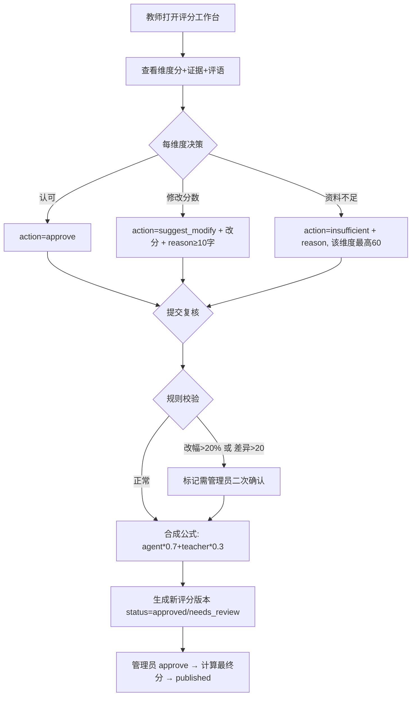
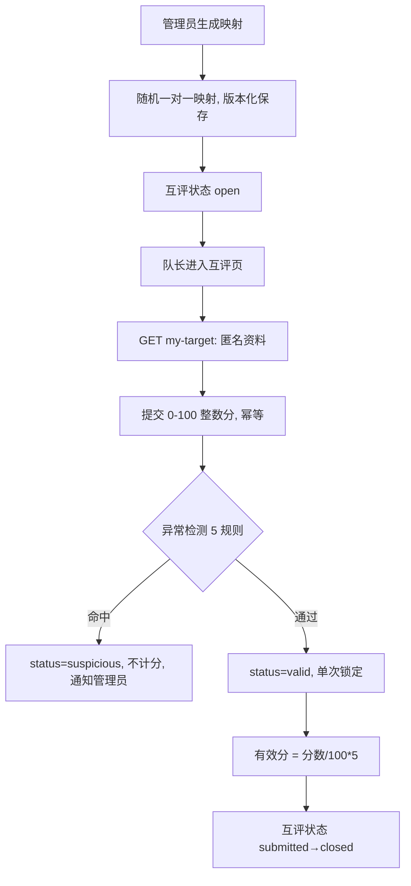
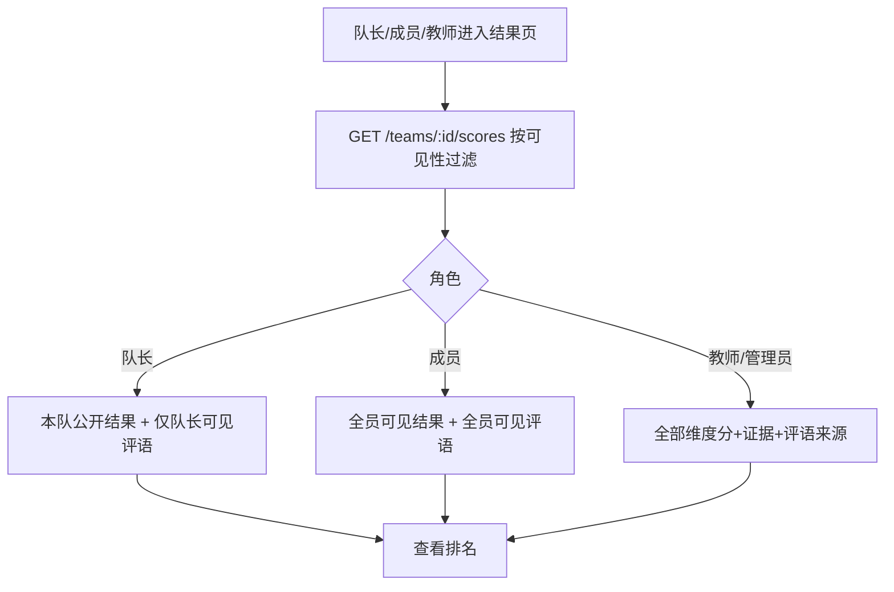
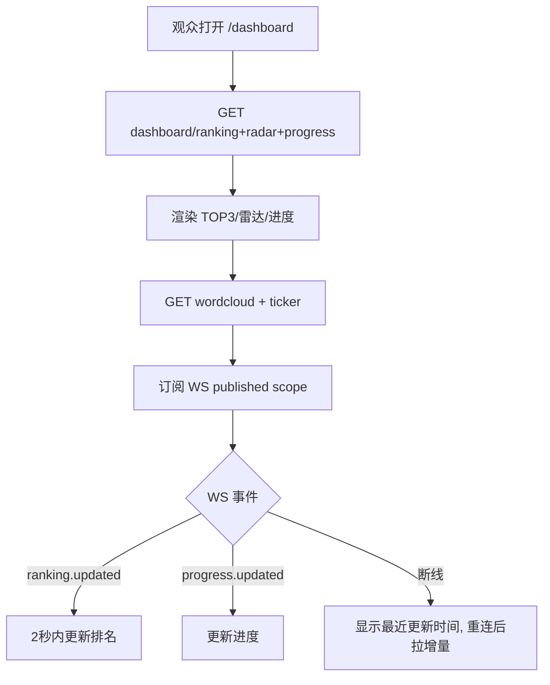

# M1-04 页面流程图

版本：V1.0（M1 设计基线）

> 覆盖开发流程要求的 7 条核心流程：登录、团队提交、Agent 评分、教师复核、队长团队互评、结果查看、大屏。每条流程标注触发角色、关键状态流转与出错分支。

---

## 1. 全局路由

| 路由 | 页面 | 角色 |
|---|---|---|
| `/login` | 登录 | 公开 |
| `/competitions` | 比赛列表 | 登录 |
| `/competitions/:id/team` | 团队提交/资料 | 队长/成员 |
| `/competitions/:id/scoring` | 评分工作台（Agent 结果 + 教师复核） | 教师/管理员 |
| `/competitions/:id/peer-review` | 队长互评 | 队长 |
| `/competitions/:id/results` | 结果查看 | 队员/教师/管理员 |
| `/dashboard` | 大屏 | 观众 |

---

## 2. 流程一：登录与鉴权

```mermaid
flowchart TD
    A[访问任意页面] --> B{已登录?}
    B -- 否 --> C[/login 登录]
    C --> D[POST /auth/login]
    D --> E{JWT 签发}
    E -- 成功 --> F[GET /auth/me 拉角色+比赛上下文]
    F --> G[建立 WS 连接 + 鉴权]
    G --> H[按角色渲染导航]
    E -- 失败 --> C
    B -- 是 --> F
```

- 全局角色：admin/teacher/audience；队长/成员在团队上下文内解析。
- 服务端 `GET /auth/me` 返回可访问比赛列表与各自在团队中的角色。

---

## 3. 流程二：团队提交



- 提交后资料锁定，截止后禁止修改；管理员可 `unlock`（必填原因，生成新版本）。

---

## 4. 流程三：Agent 评分



- 状态流转：`not_started → processing → agent_scored / needs_review`。
- 提交速度由系统在编排中注入（不经 Agent 出主观分）。

---

## 5. 流程四：教师复核



- 教师未改时教师分默认 = Agent 分。
- `needs_review` 兜底：教师 3 个工作日内选择「认可/修改/资料不足」，逾期管理员指定补评。

---

## 6. 流程五：队长团队互评（NO Push）



---

## 7. 流程六：结果查看



- 评语可见性：仅队长可见 / 全员可见 / 公示到大屏。

---

## 8. 流程七：大屏 `/dashboard`



- 大屏只读 `published`，Sankey 仅管理员模式可见。

---

## 9. 三档响应式布局

| 尺寸 | 导航 | 评分区 | 大屏 |
|---|---|---|---|
| 375px 移动 | 底部 Tab | 全屏 ScoreModal + 左滑评语 | 精简看板（排名+核心指标） |
| 768–1024px 平板 | 汉堡折叠 | 双列 | 图表降级 |
| 1920×1080 / 3440×1440 | 侧边导航 | 多列 + 完整图表 | 16:9 rem/vw 缩放，无横向滚动 |

---

## 10. 与退出条件对应

- [x] 页面流程图覆盖 7 条核心流程（登录/提交/评分/复核/互评/结果/大屏）。
- [x] 每条流程含角色、状态流转、出错分支（锁定/低置信度/异常互评）。
- [x] 三档基准尺寸布局已定义（375/1024/1920）。
