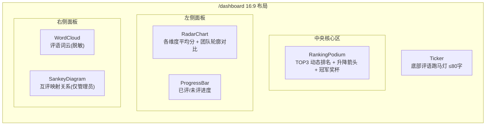

# M1-06 大屏聚合口径与脱敏规则

版本：V1.0（M1 设计基线）
依据：PRD §8（`/dashboard` 大屏需求）

> 大屏唯一数据源：`published` 状态的评分与「公示到大屏」可见性的评语。所有接口服务端过滤，前端不做二次放开。

---

## 1. 大屏组件拆分



| 组件 | 数据接口 | 聚合口径 |
|---|---|---|
| `RankingPodium` | `dashboard/ranking` | 最终分降序 + 排名升降 |
| `RadarChart` | `dashboard/radar` | 各维度「已发布团队」平均分 |
| `ProgressBar` | `dashboard/progress` | 已评/未评团队计数 |
| `WordCloud` | `dashboard/wordcloud` | 仅「公示到大屏」评语关键词 |
| `SankeyDiagram` | `dashboard/sankey`（admin） | 互评映射 reviewer→target |
| `Ticker` | `dashboard/ticker` | 最新公示评语摘要（脱敏 ≤80 字） |

---

## 2. 聚合口径

### 2.1 排名

- 数据源：`scores` 中 `status='published'` 且团队 `finalized` 的最新版本。
- 排序键（PRD §5.1）：`final_score DESC → report_quality(合成分) DESC → submitted_at ASC → team_name ASC`。
- 升降箭头：对比上一发布版本的排名变化（-1/0/+n）。

```
SELECT s.team_id, s.final_score, sd.composite_score AS report_quality, t.name, t.submitted_at
FROM scores s
JOIN teams t ON t.id = s.team_id
JOIN score_dimensions sd ON sd.score_id = s.id AND sd.dimension_key = 'report_quality'
WHERE s.status = 'published' AND t.status IN ('published','finalized')
ORDER BY s.final_score DESC, sd.composite_score DESC, t.submitted_at ASC, t.name ASC;
```

### 2.2 雷达图

- 取 6 个需评分维度（报告/交互/功能/技术/演示 + 提交速度）在「已发布团队」上的平均合成分。
- 每个团队一条轮廓线，平均值做主图叠加。

### 2.3 进度

- `total` = 已提交团队数；`scored` = 已有 `published`/`approved` 评分的团队数。

### 2.4 词云

- 关键词来源：`comments` 中 `visibility='dashboard'` 且 `status` 关联已发布评分的 `highlight`+`suggestion`。
- 分词 → 停用词过滤 → 频次统计 → 词频加权渲染。

### 2.5 桑基图（仅管理员）

- 节点 = 团队；流向 = `peer_review_mappings.mapping` 的 reviewer→target。
- 只读映射关系（不显示分数、不显示队长身份）。

### 2.6 跑马灯

- 取最新 N 条 `visibility='dashboard'` 的评语摘要，单条截断 ≤80 字。

---

## 3. 脱敏规则（PRD §8、§10）

| 数据 | 规则 |
|---|---|
| 附件原始地址 | **不返回** `object_key`/原始 URL，只给展示文案 |
| 评分来源身份 | 不展示（互评映射、评分人 user_id 均不下发） |
| 互评映射关系 | 仅管理员模式可见（Sankey），观众接口不返回 |
| 评语 PII | 去除姓名/邮箱/手机号/学号/联系方式（正则 + 字典过滤） |
| 未发布数据 | 只读 `published`；`needs_review`/`agent_scored` 一律不下发 |
| 日志隐私 | 服务端日志不落完整评语/成员联系方式 |

**脱敏管线（服务端，dashboard 模块内）**：
```
原始评语 → 实体识别(PII) → 替换为 [已隐藏] → 截断 80 字 → 下发
```

---

## 4. 数据刷新与一致性

- 目标：正常网络 2 秒内更新；断线显示最近一次更新时间。
- 增量：WS 订阅 `published` scope，`ranking.updated`/`progress.updated` 触发局部更新（排名列表/进度条），避免整页重建图表。
- 图表节流：词云/雷达图在消息频繁时按 500ms 节流合并重算。

---

## 5. 响应式与性能

- 默认 16:9，`rem/vw` 缩放；21:9 与移动精简模式**无横向滚动**。
- 低端设备自动关闭 3D 奖杯与粒子。
- 支持全屏、暂停动画、切换 CRT 扫描线、降低动效。

---

## 6. 与 PRD §11 验收对应

| 验收项 | 大屏实现 |
|---|---|
| `/dashboard` 仅展示已发布数据 | 所有查询 `status='published'` + 服务端脱敏 |
| 排名/雷达/词云/Sankey/跑马灯数据一致 | 统一 `published` + 同一 `serverTime` 快照 |
| 21:9 / 移动精简无横向滚动 | rem/vw + 断点降级 |
